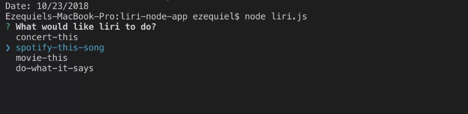

# liri-node-app
Language Interpretation and Recognition Interface, oh my!

# Liri | Node App 🤖
UT Austin Coding Bootcamp | Unit 10 node.js \
v1.0 \
Orig. Deployment - October 21, 2018

# Idea
The challenge was to write a program with node.js --- and no browser! A first for many of us in class. I decided to use inquirer to take in my answer and then based on the answer, I would ask follow up questions.

# User Guide

Here's how it works:

- Open up Terminal / your CLI
- Make sure to download the appropriate npm loaded onto the JSON file
- Type `node liri.js` and hit Enter
- Follow the prompts
- Have fun!

The game uses basic concepts in node packages, modules, and dotenv, so is good for a first run at playing with packages!

# Built Utilizing: 
dotenv \
inquirer \
node.js \
Spotify API \
Bands in Town API \
OMDB API

# Original Contributors:
Ezequiel Calderon (current edition and ongoing maintenance) - <https://github.com/playeasynow>

# Get Involved!
If you have any recommendations, let me know! Email: ezequiel.calderon.jr@gmail.com. If you'd like to take it in your own direction, go right ahead. 

Link to demo: https://drive.google.com/file/d/1WPM1oqKuEzy-Dmt3MeUzkw_w9-UFJ5LK/view
